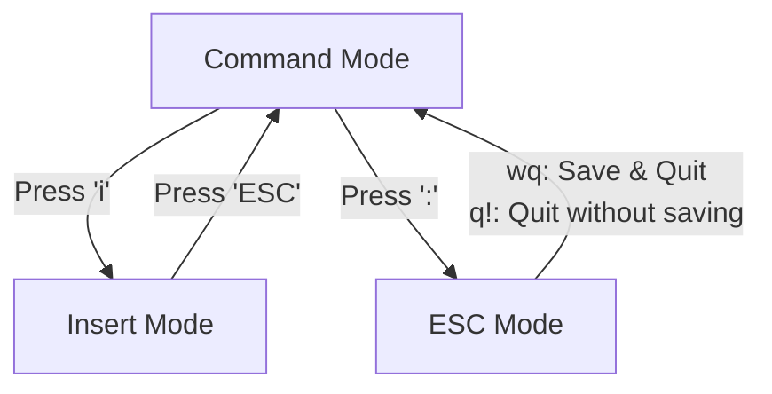
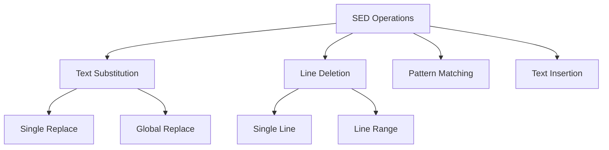
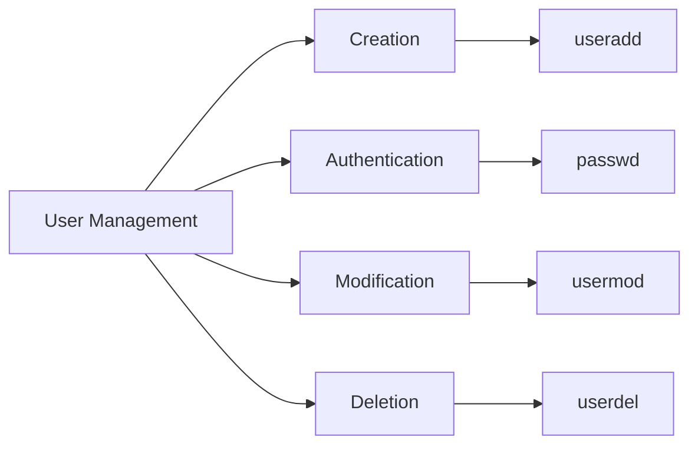
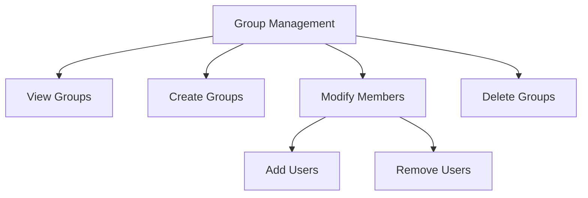
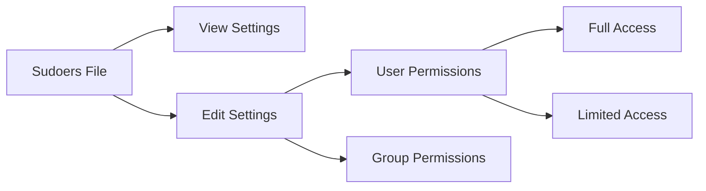

# LINUX

## **Linux File System**

### **Everything in Linux is Represented as a File**

- **Ordinary Files** (Start with `-`)
- **Directories (Folders)** (Start with `d`)
- **Link Files** (Start with `l`)

### **Basic Linux Commands**

#### **Directory Management**

- Create a Directory:
  ```bash
  mkdir <directory-name>   # Example: mkdir devops
  ```
- Delete an Empty Directory:
  ```bash
  rmdir <directory-name>   # Example: rmdir devops
  ```
- Change Directory:
  ```bash
  cd <directory-name>  # Example: cd devops
  ```
- Exit a Directory:
  ```bash
  cd ..
  ```

#### **File Management**

- Create a Normal File:
  ```bash
  touch <file-name>  # Example: touch telusko.txt alien.txt
  ```

#### **List Files in a Directory**

- List all files:
  ```bash
  ls
  ```
- List files in **alphabetical order (A-Z)**:
  ```bash
  ls -l
  ```
- List files in **reverse alphabetical order (Z-A)**:
  ```bash
  ls -lr
  ```
- List files **sorted by latest modification time**:
  ```bash
  ls -lt
  ```
- List **old files first**:
  ```bash
  ls -ltr
  ```
## ---------------------------------------------------------------------------------------------------------------------------------------------------------------------
## Introduction
In this comprehensive guide, we'll explore essential Linux commands for file management, text manipulation, and editing. Understanding these commands is crucial for DevOps engineers and AWS practitioners.

## File Management Fundamentals

### Moving and Renaming Files
The `mv` command serves two primary purposes in Linux:
```bash
# For renaming files
mv <present-name> <new-name>

# For moving files between locations
mv <present-location-filename> <new-location>
```
Think of `mv` as similar to the cut-and-paste function in graphical interfaces, but more powerful and flexible.

### File Deletion System
Linux provides several methods for removing files and directories:
```bash
# Remove individual files
rm <filename>

# Remove directories containing files
rm -rf <dir-name>   # Be cautious with this command!

# Remove empty directories
rmdir
```
Important note: Unlike graphical interfaces, Linux doesn't have a "Recycle Bin." When you delete files using these commands, they're permanently removed.

### Command History
```bash
history    # Shows your command timeline
```
This command is particularly useful for DevOps professionals who need to track their system interactions or repeat complex commands.

## Working with File Content

### File Creation and Data Management
```bash
# Create and write to a new file
cat > f1.txt    # Press Ctrl+D when finished

# Add more data to existing file
cat >> f1.txt

# View file contents
cat f1.txt      # Standard view
cat -n f1.txt   # Numbered lines for better reference
```

### Advanced File Viewing Techniques
```bash
# Reverse content viewing (bottom to top)
tac f1.txt

# Character and word reversal
rev f1.txt

# View initial portions of files
head f1.txt         # First 10 lines by default
head -n 14 f1.txt   # Customize to show first 14 lines
head -n 5 f1.txt    # First 5 lines

# View ending portions of files
tail f1.txt         # Last 10 lines by default
tail -n 5 f1.txt    # Adjust to show last 5 lines
```

## Advanced File Operations

### File Duplication
```bash
# Basic file copying
cp f1.txt f2.txt    # Creates f2.txt with f1.txt's content

# Merge multiple files
cat f1.txt f2.txt > f3.txt   # Combines contents into f3.txt
```

### Pattern Searching with grep
The Global Regular Expression Print (grep) command is invaluable for text analysis:
```bash
# Standard search
grep 'aws' f1.txt           # Finds 'aws' occurrences

# Case-insensitive search
grep -i 'AWS' f1.txt        

# Search with line numbers
grep -n 'aws' f1.txt

# Inverse search (excluding matches)
grep -v 'aws' f1.txt

# Directory-wide search
grep 'aws' *   # Searches all files in current directory
```

## Text Editing in Linux

### VI Editor: A Deep Dive
The VI editor operates in three distinct modes:



Essential VI commands:
- Enter VI: `vi <filename>`
- Start editing: Press 'i'
- Save changes: `:wq`
- Discard changes: `:q!`
 

### File Creation Methods
```bash
# Directory creation
mkdir <file-name>

# Empty file creation
touch <filename>

# Create file with content
cat > <filename>

# Create for editing
vi <filename>
```

## Utility Commands

### File Analysis
```bash
# Count lines, words, and characters
wc f1.txt

# Compare two files
diff f1.txt f2.txt
```

### Stream Editor (SED)
SED is a powerful stream editor for transforming text. It's particularly useful in DevOps for automated file modifications and text processing pipelines.

## Best Practices and Tips

1. Always verify the current directory before executing deletion commands
2. Create backups of important files before major modifications
3. Use meaningful filenames for better organization
4. Combine commands to create more efficient workflows
5. Practice VI commands regularly to build muscle memory

## ---------------------------------------------------------------------------------------------------------------------------------------------------------------------
# Linux Command-Line Operations

## 1. SED Command (Stream Editor)
SED is a powerful stream editor in Linux for basic text transformations on an input stream (a file or input from a pipeline).

### Text Substitution Operations
```bash
# Basic substitution syntax
sed 's/old/new/' filename      # Replace first occurrence in each line
sed 's/old/new/2' f1.txt      # Replace second occurrence in each line
sed 's/old/new/g' f1.txt      # Replace all occurrences in each line

# Example:
# If file.txt contains: "hello hello hello"
# sed 's/hello/hi/2' file.txt will output: "hello hi hello"
```

### Line Deletion Operations
```bash
# Delete specific lines
sed -i '3d' f1.txt            # Delete third line
sed -i '$d' f1.txt            # Delete last line
sed -i 'n,5d' f1.txt          # Delete from nth to 5th line
sed -i '3,6d' f1.txt          # Delete from 3rd to 6th line
```

### Pattern Matching Operations
```bash
# Search and manipulate based on patterns
sed -n '/python/p' f1.txt     # Print lines containing 'python'
sed '/python/d' f1.txt        # Delete lines containing 'python'
```

### Text Insertion Operations
```bash
# Add text at specific positions
sed '3i text' f1.txt          # Insert text before 3rd line
sed '$a text' f1.txt          # Append text after last line
```



## 2. User Management in Linux
Linux is a multi-user operating system where multiple users can work simultaneously.

### User Creation and Authentication
```bash
# Create and set up new users
sudo useradd <username>        # Create new user
sudo passwd <username>         # Set user password
sudo su <username>            # Switch to user
cd ~                         # Navigate to home directory
exit                        # Exit current user session
```

### User Modification and Deletion
```bash
# Modify or remove users
sudo userdel <username>       # Delete user (preserve home directory)
sudo userdel -r <username>    # Delete user and home directory
sudo usermod -l <newname> <oldname>  # Rename user
```



## 3. Group Management
Groups help organize users and control access permissions collectively.

### Basic Group Operations
```bash
# View and create groups
cat /etc/group                # List all groups
sudo groupadd <groupname>     # Create new group
id <username>                # Show user's group details
```

### Group Membership Management
```bash
# Modify group memberships
sudo usermod -aG <groupname> <username>  # Add user to group
sudo gpasswd -d <username> <groupname>   # Remove user from group
sudo lid -g <groupname>                  # List group members
```

### Group Administration
```bash
# Modify or remove groups
sudo groupdel <groupname>               # Delete group
sudo groupmod -n <newname> <oldname>    # Rename group
```



## 4. Sudoers Configuration
The sudoers file controls which users can execute commands with elevated privileges.

### Basic Sudoers Operations
```bash
# Access and modify sudoers file
sudo cat /etc/sudoers        # View sudoers file
sudo visudo                  # Edit sudoers file safely

# Standard permission format
username ALL=(ALL:ALL) ALL   # Grant full sudo access
```

> **Important**: Exercise extreme caution when editing sudoers file. Incorrect syntax can break system security.


## ----------------------------------------------------------------------------------------------------------------------------------------------------------------
# Linux User Management and File Permissions

## SSH Configuration and User Management

### EC2 to Linux VM SSH Setup

#### Initial Connection Setup
```bash
# First connect to EC2 instance using .pem file
ssh -i "your-key.pem" ec2-user@your-ec2-ip
```

#### Enable Password Authentication
```bash
# Step 1: Display current SSH configuration
$ sudo cat /etc/ssh/sshd_config
# Look for line: PasswordAuthentication no

# Step 2: Edit SSH configuration
$ sudo vi /etc/ssh/sshd_config

# Step 3: Make these changes in the file:
# Press 'i' for insert mode
PasswordAuthentication yes    # Change from 'no' to 'yes'
# Press 'esc' then type ':wq' and press enter to save

# Step 4: Restart SSH service to apply changes
$ sudo systemctl restart sshd
```

#### Practical Example
```bash
# 1. Initial connection with .pem file
$ ssh -i "myserver.pem" ec2-user@13.235.67.89

# 2. Check current SSH config
$ sudo cat /etc/ssh/sshd_config | grep PasswordAuthentication
# Output: PasswordAuthentication no

# 3. Edit configuration
$ sudo vi /etc/ssh/sshd_config
# Change line to: PasswordAuthentication yes

# 4. Verify changes
$ sudo cat /etc/ssh/sshd_config | grep PasswordAuthentication
# Output: PasswordAuthentication yes

# 5. Restart SSH
$ sudo systemctl restart sshd

# 6. Test new user connection from another terminal
$ ssh newuser@13.235.67.89
# It will now prompt for password instead of key
```

#### Common Issues and Solutions
```bash
# Issue 1: Permission denied (publickey)
# Solution: Check if PasswordAuthentication is yes
$ sudo cat /etc/ssh/sshd_config | grep PasswordAuthentication

# Issue 2: Connection refused
# Solution: Check if SSH service is running
$ sudo systemctl status sshd

# Issue 3: SSH service won't restart
# Solution: Check syntax in sshd_config
$ sudo sshd -t  # Test configuration
```

### Creating and Managing Users
```bash
# Connected to Linux VM as ec2-user with pem file
# Create new user
$ sudo useradd harsh

# Set password for new user
$ sudo passwd harsh

# Configure user in sudoers file
$ sudo visudo
# Add line: harsh ALL=(ALL:ALL) ALL --> esc --> ctrl+x+y+enter

# Enable PasswordBasedAuthentication
$ sudo vi /etc/ssh/sshd_config --> save:wq

# Restart SSH service
$ sudo systemctl restart sshd

# Connecting as new user 'harsh'
# Method 1: From same machine
$ ssh harsh@localhost
Password: (enter harsh's password)

# Method 2: From different machine (using EC2 public IP)
$ ssh harsh@13.235.67.89
Password: (enter harsh's password)

# Verify successful login
$ whoami
harsh

# Verify sudo access
$ sudo ls /root
[sudo] password for harsh: (enter harsh's password)

# Check user information
$ id harsh
uid=1001(harsh) gid=1001(harsh) groups=1001(harsh)

# If permission denied occurs, verify:
1. SSH service is running:
   $ sudo systemctl status sshd
2. Password authentication is enabled:
   $ sudo cat /etc/ssh/sshd_config | grep PasswordAuthentication
3. User has proper permissions:
   $ sudo grep harsh /etc/passwd
   $ sudo grep harsh /etc/shadow
```

## File Permissions in Linux

### Basic Permission Structure
Linux file permissions are divided into three categories for three different user types:

1. User/Owner (u)
2. Group (g)
3. Others (o)

Each category has three basic permission types:
- Read (r) → 4
- Write (w) → 2
- Execute (x) → 1

### Understanding Permission Notation

#### Symbolic Format
```
r w x   r w x   r w x
│ │ │   │ │ │   │ │ │
│ │ │   │ │ │   │ │ └── Others: Execute
│ │ │   │ │ │   │ └──── Others: Write
│ │ │   │ │ │   └────── Others: Read
│ │ │   │ │ └────────── Group: Execute
│ │ │   │ └──────────── Group: Write
│ │ │   └────────────── Group: Read
│ │ └──────────────────── User: Execute
│ └────────────────────── User: Write
└──────────────────────── User: Read
```

#### Numeric Format
Permission values (0-7):
```
0 = --- = No permission
1 = --x = Execute only
2 = -w- = Write only
3 = -wx = Write & Execute
4 = r-- = Read only
5 = r-x = Read & Execute
6 = rw- = Read & Write
7 = rwx = Read, Write & Execute
```

### Chmod Command Usage

#### Symbolic Method
```bash
# Basic syntax
chmod [u|g|o][+|-|=][r|w|x] filename

# Examples
chmod u+x file.txt    # Add execute permission for user
chmod g+w file.txt    # Add write permission for group
chmod o-x file.txt    # Remove execute permission for others
chmod o=w file.txt    # Set only write permission for others
chmod g+rwx file.txt  # Give all permissions to group
```

#### Numeric Method
```bash
# Common permission combinations
chmod 777 file.txt    # rwxrwxrwx (Full permissions)
chmod 755 file.txt    # rwxr-xr-x (Directory default)
chmod 644 file.txt    # rw-r--r-- (File default)
chmod 111 file.txt    # --x--x--x (Execute only)
chmod 444 file.txt    # r--r--r-- (Read only)
chmod 764 file.txt    # rwxrw-r-- (Custom setting)
```

### Default Permissions
```bash
# Default directory permissions
755 → rwxr-xr-x

# Default file permissions
644 → rw-r--r--

# Highest permissions
777 → rwxrwxrwx
```

## Ownership Management

### Chown Command
```bash
# Change owner
$ sudo chown username file/directory

# Change group
$ sudo chown :groupname file/directory

# Change both owner and group
$ sudo chown username:groupname file/directory
```

### Key Differences
- `chmod`: Changes file/directory permissions
- `chown`: Changes ownership (user/group)

### File Search
```bash
# Find file location
$ fs file location search
```

## Reference Quick Guide

### Permission Groups
- u → user (owner)
- g → group
- o → others

### Permission Types
- r → read (4)
- w → write (2)
- x → execute (1)

### Common Permission Patterns
```
rwx rwx rwx = 777 (Full access)
rwx r-x r-x = 755 (Directory default)
rw- r-- r-- = 644 (File default)
```

## ------------------------------------------------------------------------------------------------------------------------------------------------

# Linux Command Line Notes

## 1. Find and Locate Commands
### locate
```bash
# Install locate
$ sudo yum install locate    # For RedHat/CentOS
$ sudo apt install locate    # For Debian/Ubuntu

# Search for apache
$ locate apache
```

### find
```bash
# Search for files with name demo.txt
$ sudo find /home -name demo.txt

# Search empty files
$ sudo find /home -type f -empty

# Search empty directories
$ sudo find /home -type d -empty

# Delete 1 hour old files
$ sudo find /home -mmin +60 -delete

# Delete 30 days old files
$ sudo find /home -mtime 30 -delete
```

## 2. Working with ZIP Files
```bash
# Create zip with txt files
$ zip telusko *.txt

# Display zip content
$ zip -sf telusko.zip

# Add new file to zip
$ zip -r telusko.zip alien4.txt

# Delete file from zip
$ zip -d telusko.zip alien4.txt

# Create password protected zip
$ zip -e telusko *.txt

# Extract zip
$ unzip telusko.zip

# Delete zip
$ rm telusko.zip
```

## 3. Networking Commands
```bash
# Check connectivity
$ ping www.google.com
$ ping ifconfig

# Download files using wget
$ wget https://wordpress.org/latest.zip
$ wget https://downloads.apache.org/tomcat/tomcat-9/v9.0.85/bin/apache-tomcat-9.0.85.zip

# Download using curl
$ curl -O https://wordpress.org/latest.zip
$ curl -o tomcat.zip https://downloads.apache.org/tomcat/tomcat-9/v9.0.85/bin/apache-tomcat-9.0.85.zip

# System monitoring
$ free    # Display memory details
$ top     # Display running processes
$ htop    # Display processes in table format
```

## 4. AWK Command
- Versatile text processing tool in Linux
- Used to manipulate and extract data from text files
- Processes line by line based on patterns

```bash
# Syntax
awk 'pattern {action}' file

# Examples
$ awk '{print $1}' employee.txt              # Print first column
$ awk '{print $1,$4}' employee.txt           # Print 1st and 4th column
$ awk '/manager/ {print $1}' employee.txt    # Print 1st column if line contains 'manager'
```

## 5. Linux Links
Similar to shortcuts in Windows, in Linux we can create:

### Hard Links
```bash
# Create hard link
$ ln <original file> <link file>
$ ln ft.txt ft1.txt     # ft1.txt is hard link to ft.txt
$ ls -li    # Check inode number

# Properties
- Same inode for both files
- Data added to main file reflects in link file
- If main file is removed, hard link stays
```

### Soft Links
```bash
# Create soft link
$ ln -s <originalfile> <softlink file>
$ ln -s originalfile softlink.file   # softlink.file is a soft link
$ ls -s                              # To see soft links

# Properties
- Soft link is like a shortcut link in Windows
- Both files will have different inode number
- If we delete original data then the shortcut link file will also be deleted
- Changes in original file will be affected in the new soft link file as well
```

## 6. Package Managers
Used to install/update/manage software packages in Linux machines

### Distribution-specific managers:
- Amazon Linux/RedHat/CentOS: yum
- Debian/Ubuntu: apt

```bash
# Install git
$ sudo yum install git    # For RedHat/CentOS
$ sudo apt install git    # For Debian/Ubuntu

# Install Java
$ sudo yum install java   # For RedHat/CentOS
$ sudo apt install openjdk-11-jdk   # For Debian/Ubuntu

# Check versions
$ git --version
$ java --version
```
## ------------------------------------------------------------------------------------------------------------------------------------------------
# Linux Administration Guide

## 1. Installing Webserver in Linux VM

### Setting up HTTP Server
```bash
# Install webserver
$ sudo yum install httpd

# Start the webserver
$ sudo service httpd start

# Navigate to content directory
$ cd /var/www/html

# Edit content
$ sudo vi index.html
# Use <h1> tags in insert mode, exit with :wq!
```

**Important Notes:**
- HTTP server runs on port 80
- Must enable port 80 in security group inbound rules
- Accessible via EC2 VM public IP

## 2. Systemctl Management

### Key Operations
1. **Service Control Commands:**
   ```bash
   systemctl start service-name    # Start service
   systemctl stop service-name     # Stop service
   systemctl restart service-name  # Restart service
   systemctl reload service-name   # Reload config
   ```

2. **Boot Configuration:**
   ```bash
   systemctl enable service-name   # Enable at boot
   systemctl disable service-name  # Disable at boot
   ```

3. **Status and Information:**
   ```bash
   systemctl status service-name   # Check status
   systemctl list-units --type=service  # List all services
   ```

### SCP (Secure Copy) Between VMs

```
[Source VM] ----SCP----> [Destination VM]
```

**Process Steps:**
1. Upload file to source VM
2. Set permissions:
   ```bash
   $ chmod 400 keyfile.pem
   ```
3. Execute transfer:
   ```bash
   $ scp -i <pem-file> <source-path> username@dest-ip:/dest/path
   ```

**Example:**
```bash
$ sudo scp -i linux-devops-keypair.pem alien.txt \
  ec2-user@13.127.111.178:/home/ec2-user/
```

## 3. Linux Architecture

### Core Components

```
    [Applications]
         ↓
      [Shell]
         ↓
      [Kernel]
         ↓
    [Hardware]
```

1. **Hardware Layer:**
   - Physical components
   - Base infrastructure

2. **Kernel Layer:**
   - Core operating system
   - Manages hardware resources
   - Translates commands to machine code

3. **Shell Layer:**
   - User interface to kernel
   - Interprets commands
   - Provides command-line environment

4. **Application Layer:**
   - User programs
   - System utilities
   - Third-party software

### Command Processing Flow
1. User inputs command in shell
2. Shell interprets command syntax
3. Kernel processes the instruction
4. Hardware executes the operation

## 4. Shell Scripting

### Basic Commands
```bash
whoami  # Current user
pwd     # Present working directory
date    # System date/time
ls -l   # Detailed directory listing
cal     # Calendar
```

### Script Creation
```bash
# Create new script
$ vi first-script.sh

# View script content
$ cat first-script.sh

# Execute script
$ sh first-script.sh
```

### File System Operations
- File handling operations
- Text editing and processing
- User account management
- Permission controls
- Ownership management
- Network configuration
- Package management
- System documentation

## Linux Architecture Overview

Linux is a:
- CLI-based free and open source OS
- Secure multi-user system
- Highly recommended for servers:
  - Docker
  - Jenkins
  - k8s
  - Nexus
  - Sonar
  - Web servers
## ------------------------------------------------------------------------------------------------------------------------------------------------
# Shell Scripting Notes 📝

## Introduction to Shell Scripting 🔍

Shell scripting is a way to automate tasks in Unix/Linux systems. It allows us to write a sequence of commands in a file and execute them together.

## 1. Shebang Line in Linux
**Theory:** The shebang (#!) is a special marker that tells the system which interpreter to use to run the script. It must be the first line of the script.

```bash
#!/bin/bash
```

**What it does:** When you execute a script, the system looks at the shebang line to determine which program should interpret the rest of the file.

## 2. Variables & Input/Output
**Theory:** Variables store data that can be referenced and manipulated throughout the script. Linux shell supports user input/output operations for interactive scripts.

### Variable Rules
* ❌ No digits at start
* ❌ No special characters (., @, $, #)
* ✅ UPPERCASE names recommended

### Basic I/O Example:
```bash
#!/bin/bash

echo "Enter Your First Name"
read FNAME

echo "Enter Your Last Name"
read LNAME

echo "Your Full Name: $FNAME $LNAME"
```

### Variable Types:

1. **System Variables**
**Theory:** Predefined variables set by the system that hold important system information.
```bash
$ echo $SHELL
$ echo $USER
$ echo $PATH
```

2. **User Defined Variables**
**Theory:** Custom variables created by users to store temporary data during script execution.
```bash
FNAME=ankit
LNAME=Singh
AGE=22
```

## 3. Working with Variables
**Theory:** Variables can be accessed, modified, and managed using specific shell commands. They can also be made permanent for future shell sessions.

### Access & Manage Variables:
```bash
# Get variable value
$ echo $VARIABLE_NAME

# Create new variable
$ export COURSE=DevOpsWithAWS

# Check variable value
$ echo $COURSE

# Remove variable
$ unset COURSE
```

## 4. Arithmetic Operations
**Theory:** Shell scripting supports basic arithmetic operations using special syntax. These operations are performed on numeric variables.

### Available Operations:
| Operation | Syntax |
|-----------|--------|
| Addition | `$((num1 + num2))` |
| Subtraction | `$((num1 - num2))` |
| Multiplication | `$((num1 * num2))` |
| Division | `$((num1 / num2))` |
| Modulus | `$((num1 % num2))` |


### Calculator Example:
```bash
#!/bin/bash

echo "Enter First Number to ADD"
read FNUM

echo "Enter Second Number to ADD"
read SNUM

echo "Result of Addition: $((FNUM+SNUM))"
```

**What it does:** Takes two numbers as input and performs arithmetic operations using shell arithmetic expansion $(()).

## 5. Control Structures
**Theory:** Control structures help in making decisions and controlling the flow of execution in scripts based on conditions.

### If-Else Statement (Number Comparison):
```bash
#!/bin/bash

echo "Enter the First Number"
read NUM1
echo "Enter the Second Number"
read NUM2

if [ $NUM1 -eq $NUM2 ]; then
    echo "Numbers are Equal"
else
    echo "Numbers are Not Equal"
fi
```

**What it does:** Compares two numbers and prints whether they are equal or not.

### If-Elif-Else Statement (Number Type Check):
```bash
#!/bin/bash

echo "Enter The Number"
read NUM1

if [ $NUM1 -gt 0 ]; then
    echo "Positive Number"
elif [ $NUM1 -lt 0 ]; then
    echo "Negative Number"
else
    echo "Number is Zero"
fi
```

**What it does:** Takes a number as input and determines if it's positive, negative, or zero using if-elif-else construct.

## 6. Loops
**Theory:** Loops allow repetitive execution of a set of commands until a specific condition is met.

### For Loop:
**Usage:** Used when you know the number of iterations in advance.
```bash
#!/bin/bash

for((i=1;i<=6;i++))
do
    echo "$i"
done
```

### While Loop:
**Usage:** Used when the number of iterations depends on a condition.
```bash
#!/bin/bash

echo "Enter the Number"
read NUM

while [ $NUM -le 6 ]
do
    echo "$NUM"
    let NUM++
done
```

## 7. Functions
**Theory:** Functions are reusable blocks of code that perform specific tasks. They help in organizing code and avoiding repetition.

### Basic Function:
**Usage:** Simple function demonstrating code organization.
```bash
#!/bin/bash

function greeting() {
    echo "Hello all!"
    echo "Welcome to Telusko!"
    echo "DevOps!"
}

greeting
```

### File Management Function:
**Usage:** Advanced function showing file operations and condition handling.
```bash
#!/bin/bash

function fileManager() {
    echo "Enter the file name"
    read FILENAME
    
    if [ -f "$FILENAME" ]; then
        echo "file is present the content is shown below"
        cat $FILENAME
    else
        echo "File is not present with name hence creating new file"
        touch $FILENAME
        echo "File is created"
    fi
}

fileManager
```

## Running Scripts 🚀
**Theory:** Scripts need proper permissions and can be executed in multiple ways. Different execution methods provide flexibility in how you run your scripts.

### Ways to Execute Scripts:

1. Make script executable:
```bash
chmod +x script_name.sh
./script_name.sh
```

2. Using bash interpreter:
```bash
bash script_name.sh
```

3. Using sh interpreter:
```bash
sh script_name.sh
```

> **💡 Pro Tips:**
> - Always test scripts in a safe environment
> - Use comments to explain complex logic
> - Follow consistent naming conventions
> - Keep scripts modular and reusable
> - `./script_name.sh` requires executable permissions
> - `bash` or `sh` works without changing file permissions


---
